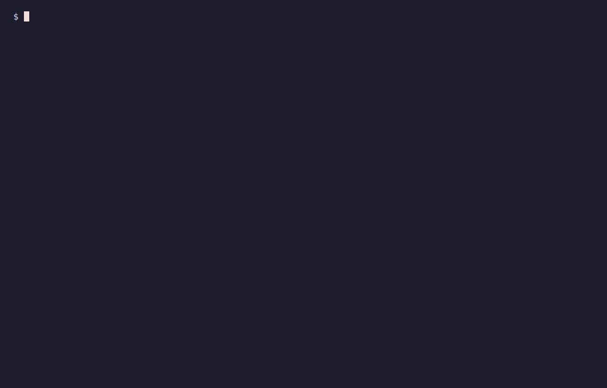
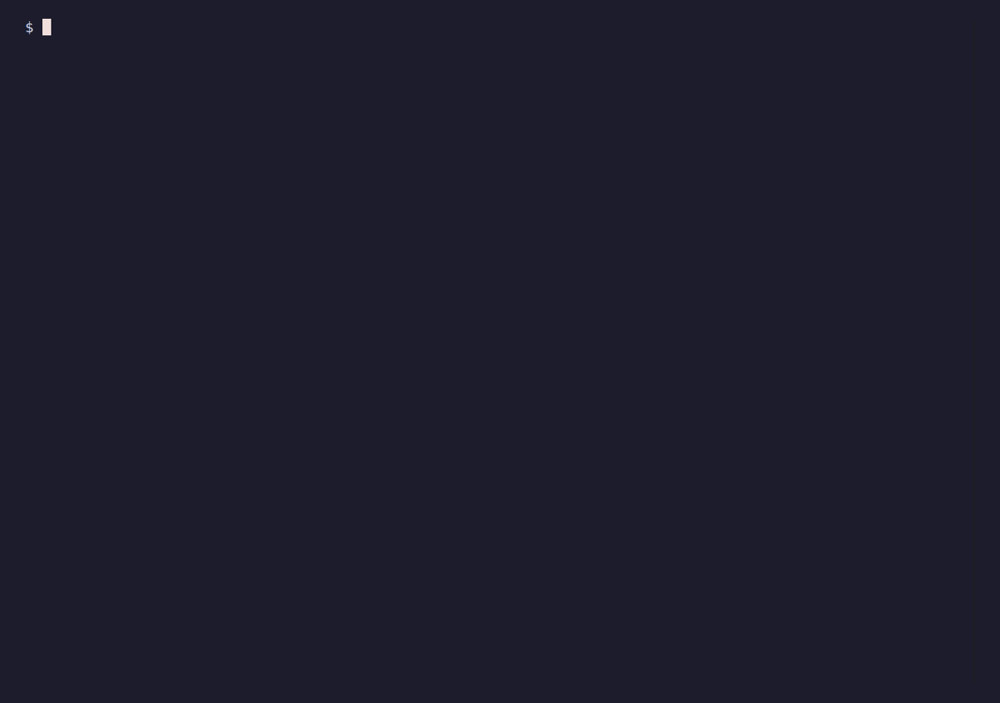
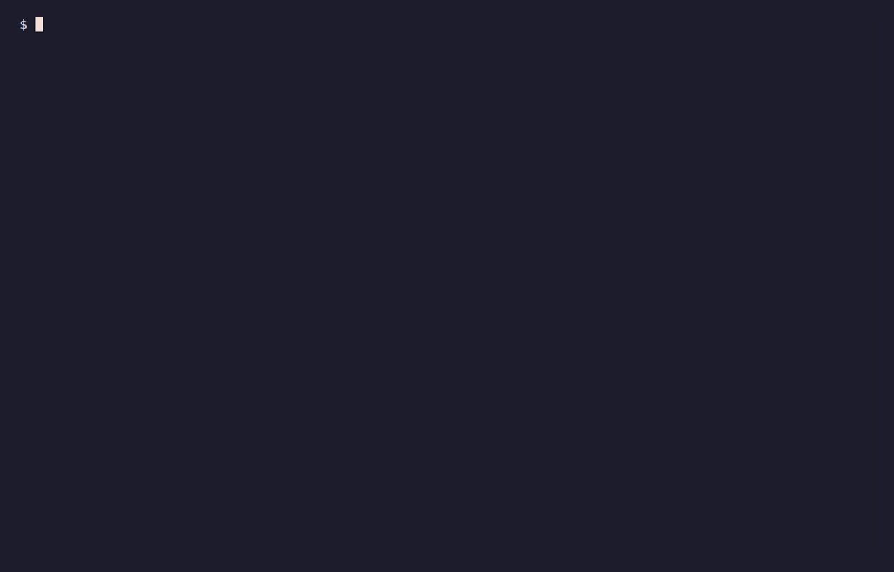

# Demo

A visual tour of `cct`. Everything below runs against throwaway demo sessions —
never a real `~/.codex` or `~/.claude`, so no real prompts, code, or paths appear.

### Move sessions between machines, incrementally

Export on one machine, sync onto the other — only what's new is appended,
nothing is re-pasted or overwritten.


### Sync over your local network

Same Wi-Fi? Skip the file — `cct sync` pairs the two devices with a one-time code
and moves new/grown sessions both ways. Peer-to-peer, no server, opt-in.


### Carry the history in git, without putting it in the code repo

`cct skill install` teaches your agent the workflow; the project commits only a
reference to a private session store, and a clone on the second machine restores
the chats with `import --merge --map-cwd-here`.


### Find a past conversation

Full-text search across your sessions, then export just what matches.



### Check for secrets before sharing

`cct scan` flags likely API keys/tokens; `export --redact` replaces them with
placeholders.


### Save a session as readable Markdown

`export --format md` turns a conversation into a shareable document.


### Fix slow-opening imported sessions

`doctor` spots imported files whose timestamps confuse the agent; `repair-times`
fixes them (timestamps only, never content).



### Desktop app

The same features in a local browser GUI (`cct app`).


### Cross-agent handoff

Translate Codex sessions into Claude Code (or back).


### Encryption

Encrypt a bundle to an age key; decrypt it with your private key.


### When a session changed on both machines

Replace and keep a backup, keep both copies, or redirect the project path.


### Export only what you need

By project, by single session, or by "changed since".



### Carry the matching code too

Record the project's git remote/commit, then clone it on the other side.


### Guided, if you prefer menus over flags


### Compressed sessions

Codex stores older sessions as `.jsonl.zst`; with `zstd` installed, `cct` reads
them like any other.


---

<details>
<summary>How these are recorded (for contributors)</summary>

The rendered GIFs live in `clips/`; the scripts that produce them are in
`recording/`. Terminal clips are rendered with
[VHS](https://github.com/charmbracelet/vhs); the WebUI clip with
[Playwright](https://playwright.dev). Nothing here touches a real agent home —
`recording/gen_demo_home.py` writes fake Codex homes under a temp dir and the
clips point `CODEX_HOME`/`CLAUDE_HOME` at them.

- `recording/gen_demo_home.py <base>` — fake Codex homes (`laptop/`, `pc/`) with
  demo sessions. `CCT_DEMO_BASE` overrides the project-path prefix (Windows paths
  for the WebUI clip).
- `recording/prep.sh <scenario>` — per-tape setup: `base`, `claude`, `enc`,
  `conflict`, `mapcwd`, `git`, `zstd`, `secrets` (injects fake EXAMPLE keys), and
  `stale` (a session whose mtime runs ahead of its content).
- `recording/*.tape` — VHS scripts (typed commands + timing).
- `recording/record.sh` — renders all terminal GIFs into `clips/` in one shot.
- `webui-rec/` — the Playwright project that records `clips/10-webui.gif`.

**Terminal clips (VHS, needs Linux + `ttyd` + `ffmpeg`; on Windows use WSL):**

```bash
wsl -d Ubuntu -- bash -lc 'bash /path/to/repo/demo/recording/record.sh'
```

`record.sh` is self-bootstrapping (no sudo): it fetches the headless-Chromium NSS
libs locally, installs `age` if missing, and builds `cct` from source. One-time:
`vhs` (`go install github.com/charmbracelet/vhs@latest`) and a static `ttyd`
binary on `PATH`.

**WebUI clip (Playwright, runs on Windows where Chrome has its libraries):**

```powershell
cd demo/webui-rec
npm install && npx playwright install chromium
$env:CCT_HOME = "C:\path\to\cct-webui-demo\laptop\codex-home"
node record-webui.mjs            # writes out/<hash>.webm
# convert webm -> gif with ffmpeg (palette flags as in record.sh)
```

</details>
